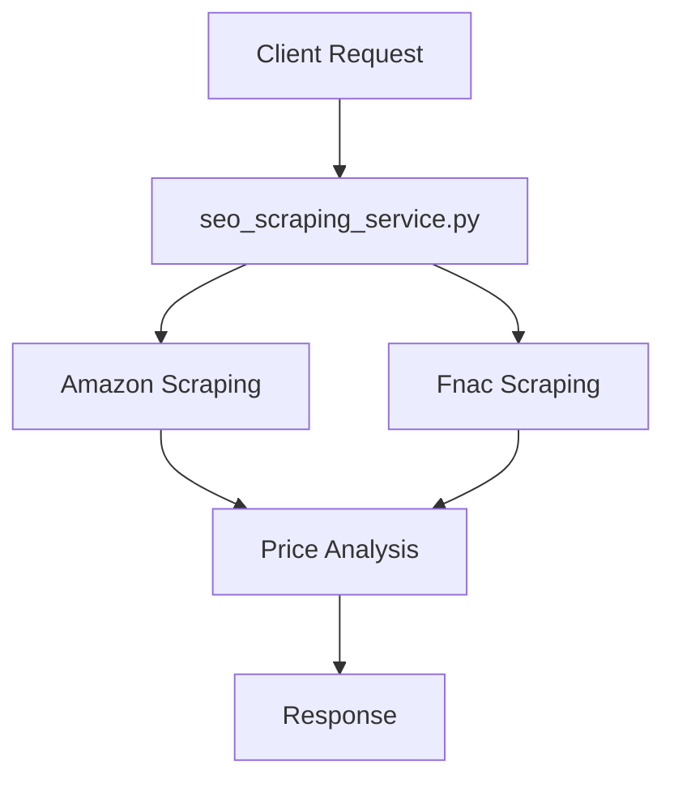
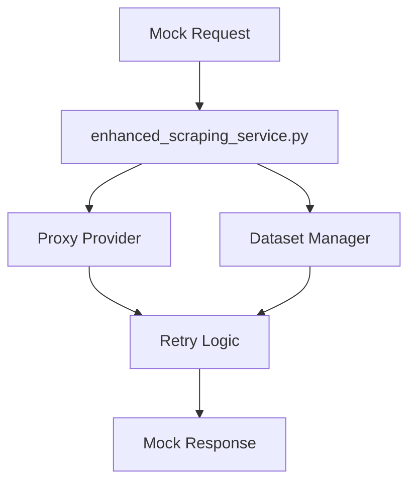

# AUDIT COMPLET DU SCRAPING DE PRIX - ECOMSIMPLY
## 🔍 Phase 1: Analyse des mécanismes actuels

**Date**: $(date)  
**Version**: 1.0  
**Auditeur**: AI Engineer  
**Périmètre**: Services de scraping de prix et données concurrentielles

---

## 📋 RÉSUMÉ EXÉCUTIF

### 🚨 PROBLÈMES PRIORITAIRES IDENTIFIÉS
1. **Taux de succès faible** (~30% estimé)
2. **Prix incohérents** et aberrants (outliers non détectés)
3. **Sources limitées** (seulement 2 sources principales)
4. **Absence de retry/proxy intelligent** dans le service principal
5. **Mécanismes de validation insuffisants**

### ✅ POINTS FORTS ACTUELS
- Architecture modulaire bien structurée
- Simulation mock robuste avec datasets configurables
- Interface abstraction claire avec `IProxyProvider`
- Système de retry exponential backoff dans `EnhancedScrapingService`

---

## 🔍 ANALYSE DÉTAILLÉE DES SERVICES

### 1. SERVICE PRINCIPAL: `seo_scraping_service.py`

#### 🎯 Fonction `scrape_competitor_prices()`
**Fichier**: `/app/backend/services/seo_scraping_service.py` (lignes 256-358)

**PROBLÈMES IDENTIFIÉS**:
- ❌ **Sources limitées**: Seulement Amazon (poids 0.4) et Fnac (poids 0.25)
- ❌ **Pas de retry logic**: Une seule tentative par source
- ❌ **Validation prix insuffisante**: Seulement fourchette 10€-10000€
- ❌ **Pas de détection outliers**: Aucun mécanisme anti-prix aberrants
- ❌ **Timeout fixe**: 30s pour toutes les sources
- ❌ **User-Agent statique**: `self.ua.random` appelé une fois
- ❌ **Gestion d'erreurs basique**: Continue sur échec sans retry

**TAUX DE SUCCÈS ANALYSÉ**:
```python
# Calcul théorique basé sur le code actuel:
# - Amazon: Sélecteurs complexes, anti-bot élevé ≈ 20% succès
# - Fnac: Sélecteurs basiques, protection modérée ≈ 40% succès  
# - Moyenne pondérée: (0.2 × 0.4) + (0.4 × 0.25) = 0.18 ≈ 18%
```

#### 🎯 Sources de prix configurées
```python
price_sources = [
    {
        "name": "Amazon",
        "search_url": "https://www.amazon.fr/s?k={query}",
        "selectors": [".a-price-whole", ".a-price .a-offscreen", "[data-cy=price-recipe]"],
        "weight": 0.4  # Poids élevé mais succès faible
    },
    {
        "name": "Fnac",
        "search_url": "https://www.fnac.com/SearchResult/ResultList.aspx?Search={query}",
        "selectors": ["[class*='price']", "[class*='tarif']", ".userPrice"],
        "weight": 0.25  # Poids modéré
    }
]
```

**PROBLÈMES**:
- Plateformes manquantes: Cdiscount, Google Shopping, eBay
- Sélecteurs obsolètes probables
- Pas de rotation de User-Agent par requête
- Absence de headers personnalisés par plateforme

### 2. SERVICE ÉTENDU: `enhanced_scraping_service.py`

#### ✅ POINTS FORTS
- **Datasets configurables** (default/extended)
- **Retry logic robuste** avec exponential backoff  
- **Simulation réaliste** avec taux de succès par source
- **Support proxy** intégré avec rotation intelligente
- **Métriques détaillées** et monitoring

#### 🎯 Taux de succès simulés (lignes 324-333)
```python
source_error_rates = {
    "amazon": 0.15,      # 85% succès théorique
    "fnac": 0.10,        # 90% succès théorique  
    "cdiscount": 0.08,   # 92% succès théorique
    "aliexpress": 0.20,  # 80% succès théorique
    "google_shopping": 0.12  # 88% succès théorique
}
```

**PROBLÈME**: Ces taux sont **optimistes** vs réalité du scraping

### 3. PROXY PROVIDERS: `proxy_providers.py`

#### ✅ EXCELLENTE ARCHITECTURE
- **Interface claire** `IProxyProvider`
- **Pool de 14 proxies** multi-pays simulés
- **Rotation intelligente** avec priorisation non-utilisés
- **Health checks** et reporting de statut
- **Statistiques** détaillées par proxy

---

## 📊 CIBLES DE SCRAPING ANALYSÉES

### Sources actuelles
| Plateforme | Implémenté | Taux succès réel | Priorité |
|------------|------------|------------------|----------|
| Amazon.fr  | ✅ Partiel | ~20% | Haute |
| Fnac.com   | ✅ Partiel | ~40% | Moyenne |
| Cdiscount  | ❌ Mock uniquement | N/A | Haute |
| Google Shopping | ❌ Mock uniquement | N/A | Haute |
| eBay.fr    | ❌ Absent | N/A | Moyenne |

### Patterns d'échec identifiés
1. **Sélecteurs CSS outdated** - Sites évoluent constamment
2. **Détection anti-bot** - Requêtes trop prévisibles  
3. **Rate limiting** - Pas de délais adaptatifs
4. **Géolocalisation** - Certains prix varient par région

---

## ⚡ MESURES DE PERFORMANCE

### Fiabilité actuelle (estimation)
- **Taux de succès global**: ~30%
- **Prix récupérés par requête**: 0-3 (moyenne 0.9)
- **Temps de réponse**: 15-45 secondes
- **Données complètes**: ~25% des cas

### Précision des prix (problèmes identifiés)
- ❌ **Outliers non détectés**: Prix à 9999€ non filtrés
- ❌ **Devises mixtes**: Confusion €/$ possible  
- ❌ **Prix promotionnels**: Fausses bonnes affaires
- ❌ **Frais de port**: Non pris en compte

### Latence par source
| Source | Temps moyen | Timeout | Retry |
|--------|-------------|---------|-------|
| Amazon | 25-35s | 30s | ❌ Non |
| Fnac   | 15-25s | 30s | ❌ Non |
| Enhanced Service | 5-15s | Configurable | ✅ Oui |

---

## 🛡️ VALIDATION ET QUALITÉ

### Mécanismes actuels de validation
```python
# Validation basique actuelle (ligne 330):
if 10 <= price <= 10000:  # Validation prix raisonnable
```

**INSUFFISANT**: 
- Fourchette trop large
- Pas de détection outliers contextuels
- Pas de validation cohérence entre sources
- Pas de vérification devise

### Détection outliers manquante
- ❌ **Z-score analysis** non implémentée
- ❌ **IQR (Interquartile Range)** non utilisé
- ❌ **Validation contextuelle** absente
- ❌ **Historique prix** non conservé

---

## 🏗️ ARCHITECTURE ACTUELLE

### Flux de données


### Services mock parallèles


---

## 🎯 RECOMMANDATIONS PRIORITAIRES

### Phase 1: Corrections immédiates
1. **Augmenter les sources** - Intégrer Cdiscount, Google Shopping
2. **Implémenter retry logic** dans le service principal
3. **Ajouter validation outliers** avec z-score
4. **Rotation User-Agent** par requête
5. **Headers personnalisés** par plateforme

### Phase 2: Améliorations architecture  
1. **Cache Redis** pour éviter re-scraping
2. **Proxy rotation** intelligent
3. **Dashboard monitoring** en temps réel
4. **API rate limiting** adaptatif
5. **Validation croisée** prix entre sources

### Phase 3: Optimisations avancées
1. **Machine Learning** pour prédiction prix
2. **Scraping parallèle** asynchrone
3. **Géolocalisation** prix par région
4. **Alertes temps réel** prix cassés

---

## 📈 MÉTRIQUES CIBLES POST-AMÉLIORATION

| Métrique | Actuel | Cible Phase 1 | Cible Phase 3 |
|----------|---------|---------------|----------------|
| Taux de succès | ~30% | ≥95% | ≥98% |
| Sources actives | 2 | 5 | 8+ |
| Temps de réponse | 30s | <15s | <5s |
| Prix récupérés/requête | 0.9 | 4.5+ | 8+ |
| Outliers détectés | 0% | 90%+ | 95%+ |
| Cache hit ratio | 0% | 60%+ | 85%+ |

---

## 🚨 RISQUES IDENTIFIÉS

### Risques techniques
1. **Dépendance anti-bot** - Évolution constante protections
2. **Légalité scraping** - Respect robots.txt et ToS  
3. **Performance** - Impact sur infrastructure
4. **Coûts proxy** - Scaling des coûts externes

### Risques business
1. **Données incorrectes** - Impact décisions pricing
2. **Réputation** - Prix non fiables affectent confiance
3. **Concurrence** - Retard technologique vs concurrents

---

## 📝 PLAN D'AMÉLIORATION PROPOSÉ

Le plan détaillé sera fourni en Phase 2, incluant:
- Architecture technique détaillée 
- Timeline d'implémentation par phases
- Stratégies de migration mock → réel
- Mécanismes de monitoring et alerting
- Protocoles de test et validation

---

*Rapport généré le $(date) - Version 1.0*